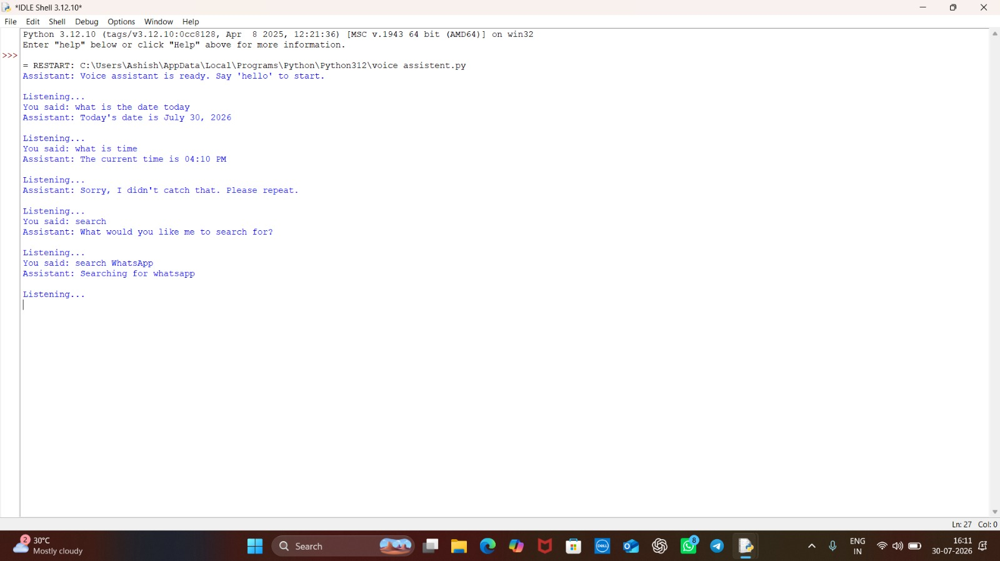

# 🎙️ Voice Assistant

A Python-based voice assistant that listens to spoken commands and responds with useful actions like greetings, time, date, and web search.

## 📸 Screenshots

## 🛠️ Built With
- Python 3.12
- speech_recognition (voice input)
- pyttsx3 (text-to-speech)
- datetime
- webbrowser

## ✅ Features
- Captures voice input using the microphone
- Responds to "hello" with a greeting
- Tells the current time and date on request
- Performs a web search on a user-specified topic
- Graceful error handling — asks the user to repeat if unclear
- Text-to-speech feedback for all responses

## 📂 Project Structure

    Python-Task1-VoiceAssistant/
    ├── voice_assistant.py
    ├── README.md
    └── voice_assistant_output.png

## 🚀 How to Run
> ⚠️ Note: This project requires Python 3.12 (not 3.14), as speech_recognition and PyAudio don't yet have compatible wheels for Python 3.14.

    py -3.12 -m pip install SpeechRecognition pyttsx3 PyAudio
    py -3.12 voice_assistant.py

Say "hello" to start, then try commands like "what's the time", "what's the date", or "search Python tutorials". Say "exit" or "stop" to quit.

## 📖 What I Learned
- Working with real-time audio input using speech_recognition
- Converting text to speech with pyttsx3
- Handling recognition errors gracefully (unclear audio, service errors)
- Managing Python version compatibility issues with third-party libraries
- Structuring command-handling logic with conditional checks

## 👤 Author
Anant Kumar Agarwal — B.Tech CSE, RIT

## 📄 License
This project is licensed under the MIT License.
