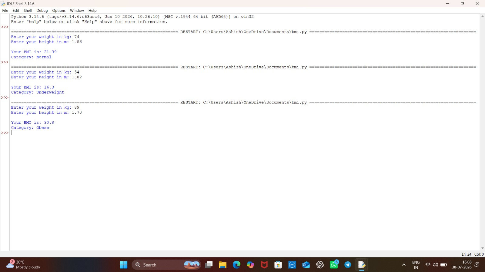

# 🧮 BMI Calculator

A simple command-line Python tool that calculates Body Mass Index (BMI) and classifies it into standard health categories.

## 📸 Screenshots

## 🛠️ Built With
- Python 3
- input() and basic arithmetic

## ✅ Features
- Prompts for weight (kg) and height (m)
- Calculates BMI = weight / height²
- Classifies into Underweight / Normal / Overweight / Obese
- Input validation for non-numeric and negative values

## 📂 Project Structure

    Python-Task2-BMICalculator/
    ├── bmi_calculator.py
    ├── README.md
    └── bmi_calculator_output.png

## 🚀 How to Run

    python bmi_calculator.py

## 📖 What I Learned
- Writing reusable validation functions
- Using conditional logic for classification
- Basic error handling with try/except

## 👤 Author
Ashish Kumar — B.Tech EE, RIT

## 📄 License
This project is licensed under the MIT License.
